<div align="center">

# Aestimo

### Turn your resume into your career copilot.

An AI-powered career assistant built with Flutter. Upload your resume and Aestimo turns it into actionable insights, a resume score, tailored cover letters, interview prep, job matches, an ATS-optimized resume, and a chat that actually knows your background — all grounded in your real experience using Google Gemini.


[Live Demo](https://aestimo-career-copilot.web.app) · [Download (Windows / Android)](https://github.com/ArsalanKaleem/Aestimo/releases) · [Report a Bug](https://github.com/ArsalanKaleem/Aestimo/issues) · [Request a Feature](https://github.com/ArsalanKaleem/Aestimo/issues)

</div>

---

## 📑 Table of Contents

- [Overview](#-overview)
- [Features](#-features)
- [Download](#-download)
- [Screenshots](#-screenshots)
- [Tech Stack](#️-tech-stack)
- [Architecture](#-architecture)
- [Getting Started](#-getting-started)
- [Configuration](#-configuration)
- [Deployment](#️-deploy-firebase-hosting)
- [Roadmap](#-roadmap)
- [Contributing](#-contributing)
- [Author](#-author)
- [License](#-license)

---

## ✨ Overview

Aestimo reads your resume once and powers every feature from it. There's no manual data entry — upload a PDF, and the app extracts, understands, and uses your experience to help you land your next role.

Every answer, score, and suggestion is grounded in the resume you actually uploaded rather than generic advice, so the output stays specific to your background instead of reading like a template. It runs on **Android, Web, and Windows** from a single Flutter codebase, with Firebase handling authentication and hosting, and Google Gemini powering the AI layer end to end — extraction, scoring, chat, and generation.

Try it instantly in the browser at the live demo link above, or grab a native build from [Releases](https://github.com/ArsalanKaleem/Aestimo/releases) if you'd rather install it on Windows or Android.

## 🚀 Features

- **Resume Upload & Parsing** — drop in a PDF; Gemini extracts and structures the content.
- **Resume Insights** — skills, experience, strengths, and gaps at a glance.
- **Resume Score** — an objective score with concrete, prioritized improvements.
- **ATS Resume** — generate an ATS-optimized version of your resume.
- **AI Chat** — ask anything about your career; every answer is grounded in your resume with sources.
- **Interview Prep** — personalized questions plus a live, interactive mock interview with feedback.
- **Job Match** — live roles ranked against your resume.
- **Cover Letter Generator** — tailored letters written from your background.
- **Secure Auth** — email/password sign-in via Firebase Authentication.
- **Adaptive UI** — a navigation rail on desktop/tablet and a slide-out drawer on mobile.

## 📥 Download

Aestimo runs anywhere without installing anything via the [live web app](https://aestimo-career-copilot.web.app), or you can install a native build:

| Platform | How to get it |
|---|---|
| 🌐 **Web** | Open [aestimo-career-copilot.web.app](https://aestimo-career-copilot.web.app) — nothing to install |
| 🪟 **Windows** | Download the latest installer `.exe` from [**Releases**](https://github.com/ArsalanKaleem/Aestimo/releases) and run it |
| 🤖 **Android** | Download the latest `.apk` from [**Releases**](https://github.com/ArsalanKaleem/Aestimo/releases) and install it |

> Windows Setup and the Android APK aren't code-signed yet, so you may see a SmartScreen or "unknown sources" prompt on first install — this is expected for a self-distributed build. Choose **More info → Run anyway** on Windows, or allow installs from your browser/file manager on Android.

Check the [Releases page](https://github.com/ArsalanKaleem/Aestimo/releases) for release notes, version history, and checksums on each build.

## 📸 Screenshots

### Login

| Desktop | Mobile |
|----------|---------|
| 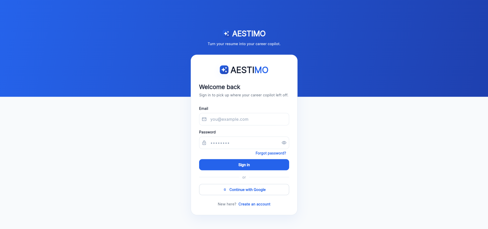 | 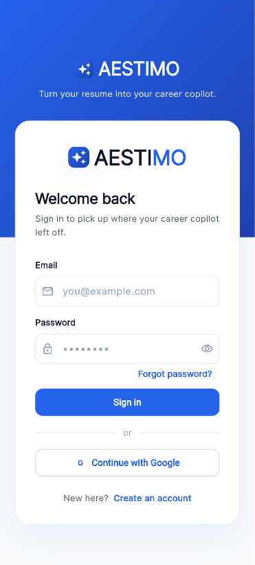 |

---

### Dashboard

| Desktop | Mobile |
|----------|---------|
| 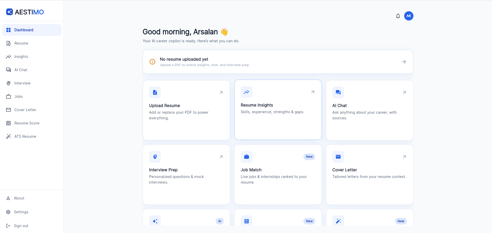 | 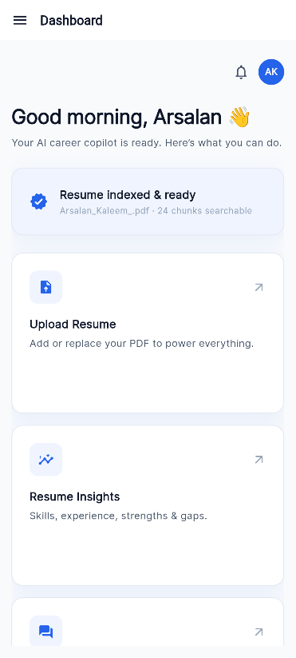 |

---

### Upload Resume

| Desktop | Mobile |
|----------|---------|
| 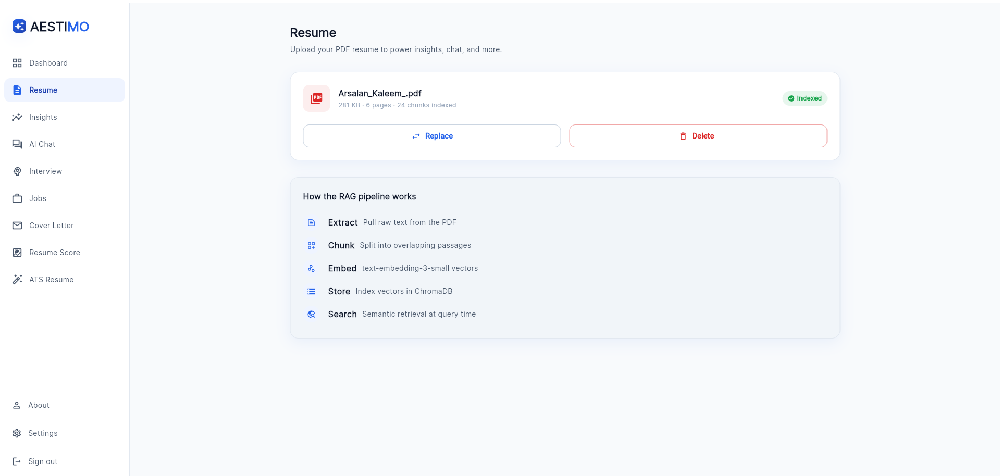 | 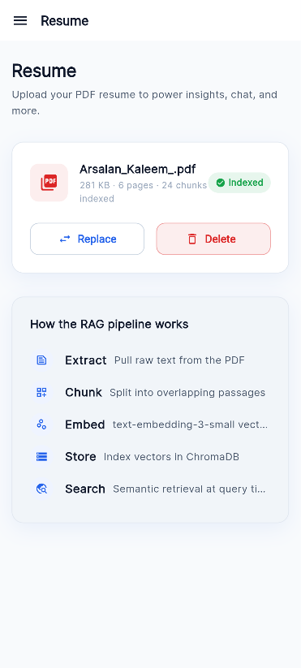 |

---

### Resume Insights

| Desktop | Mobile |
|----------|---------|
| 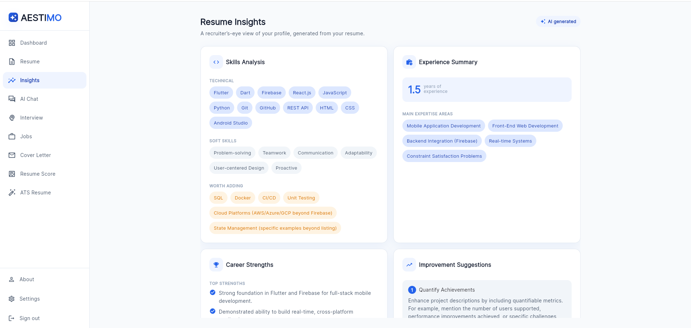 | 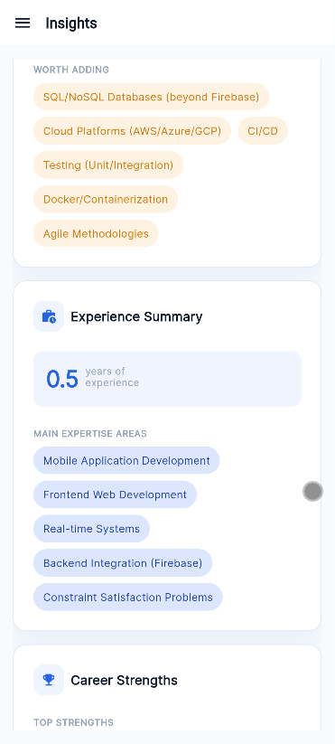 |

---

### Resume Score

| Desktop | Mobile |
|----------|---------|
| 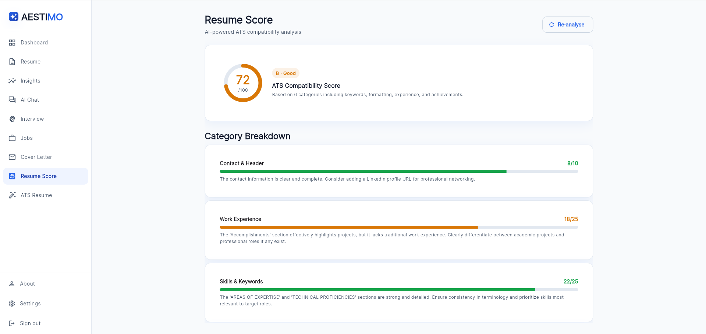 | 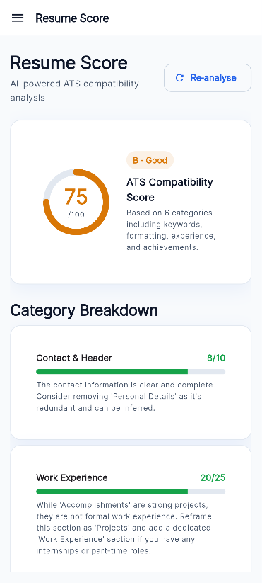 |

---

### ATS Resume

| Desktop | Mobile |
|----------|---------|
| 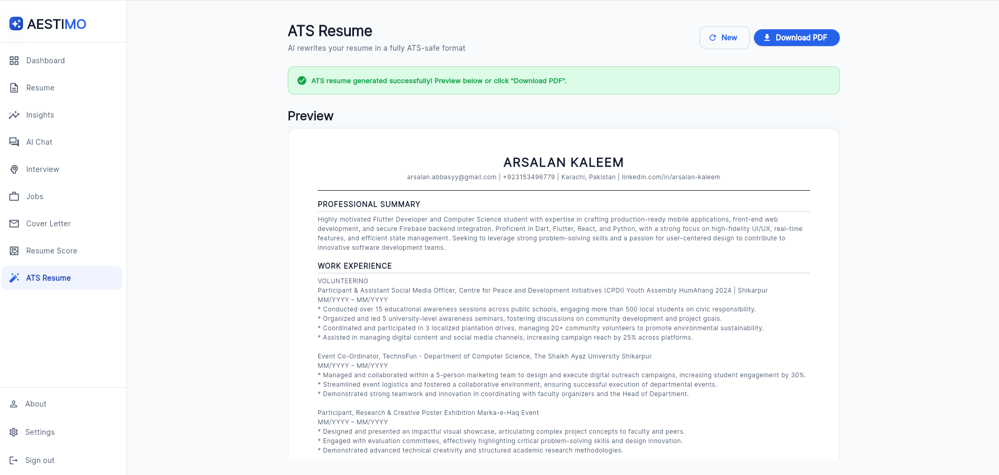 | 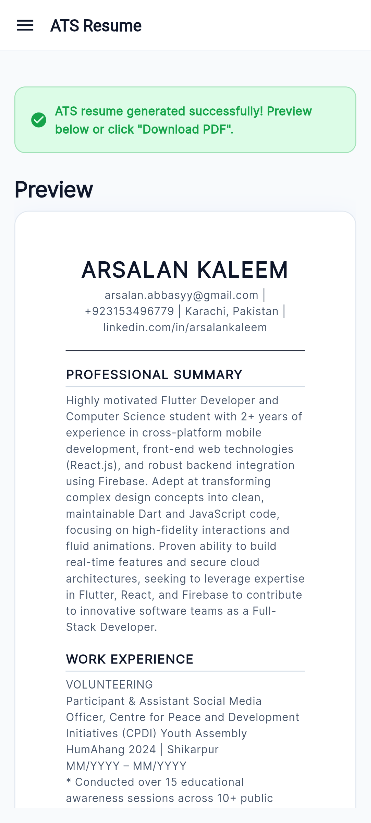 |

---

### AI Chat

| Desktop | Mobile |
|----------|---------|
| 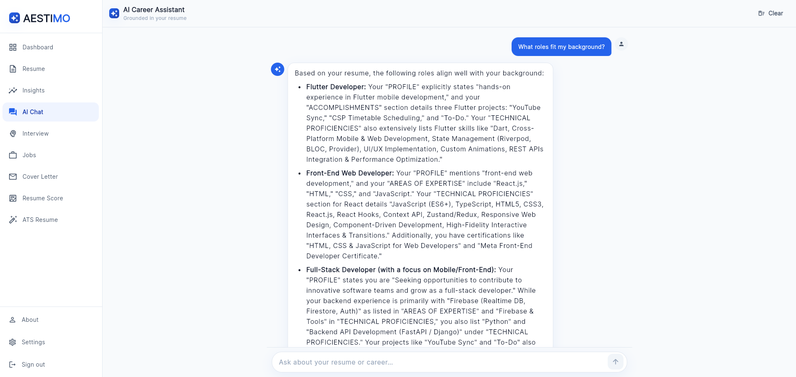 | 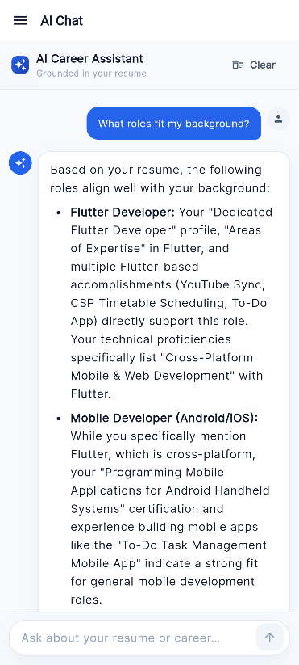 |

---

### Interview Prep

| Desktop | Mobile |
|----------|---------|
| 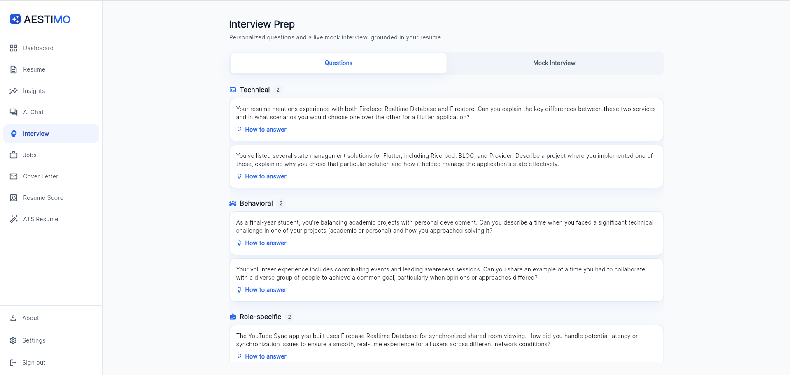 | 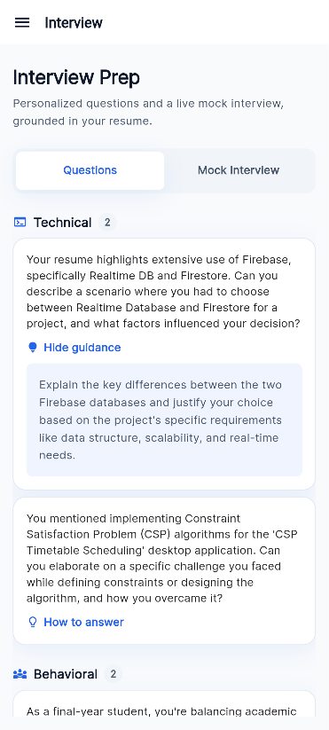 |

---

### Job Match

| Desktop | Mobile |
|----------|---------|
| 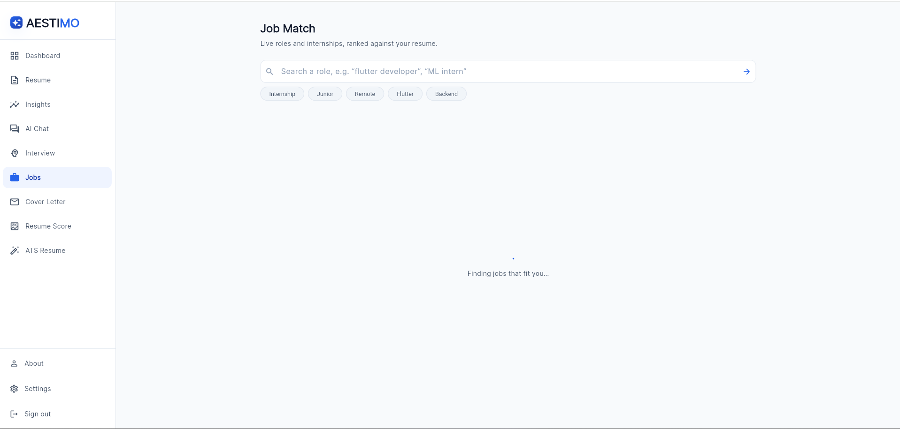 | 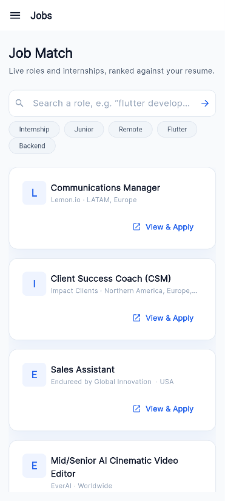 |

---

### Cover Letter

| Desktop | Mobile |
|----------|---------|
| 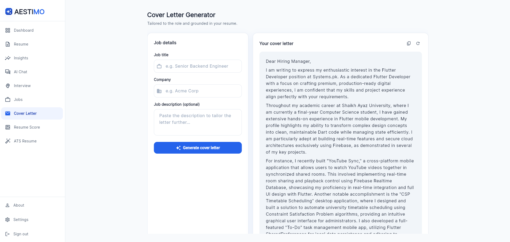 | 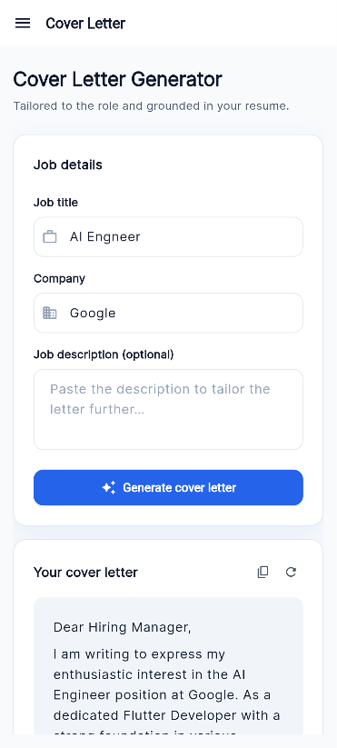 |

---

### About

| Desktop | Mobile |
|----------|---------|
| 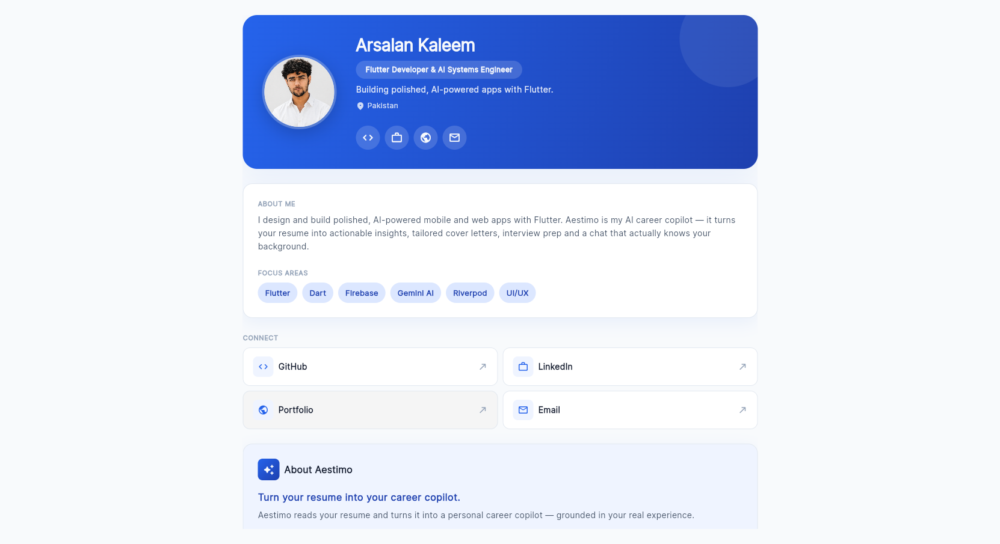 | 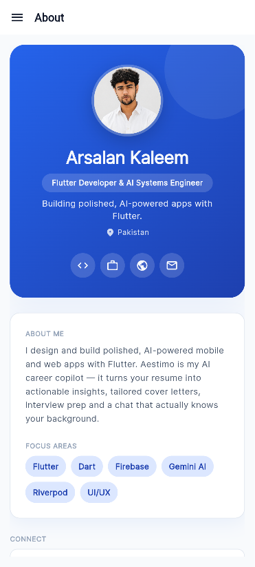 |

---

### Settings

| Desktop | Mobile |
|----------|---------|
| 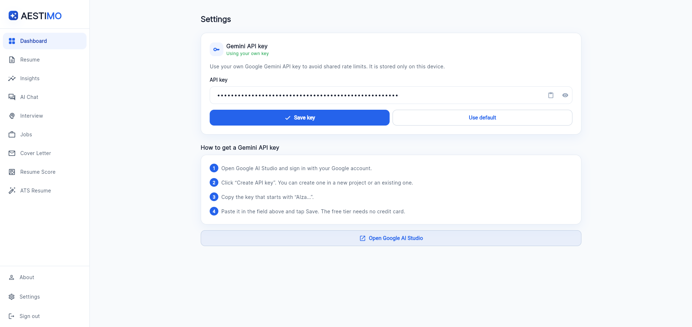 | 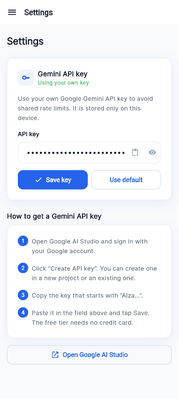 |

## 🛠️ Tech Stack

| Layer | Tools |
|-------|-------|
| **Framework** | Flutter, Dart |
| **State** | Riverpod |
| **Routing** | GoRouter |
| **AI** | Google Gemini (Generative Language API) |
| **Auth** | Firebase Authentication |
| **Hosting** | Firebase Hosting |
| **Networking** | Dio |
| **Other** | file_picker, url_launcher, flutter_markdown_plus |

## 🏗️ Architecture

Feature-first clean architecture. Each feature owns its `models / data / providers / presentation` layers, so functionality stays isolated and easy to extend without touching unrelated parts of the app.

```
lib/
├── core/            # constants, theme, router, networking, Gemini client, utils
├── features/        # auth, dashboard, upload_resume, insights, rag_chat,
│                    # interview_prep, job_match, cover_letter, resume_score,
│                    # ats_resume, about, settings
├── shared/widgets/  # reusable UI (cards, buttons, shell, drawer, ...)
└── main.dart
```

State is managed with Riverpod providers scoped per feature, navigation runs through GoRouter with a shared responsive shell, and all AI calls flow through a single Gemini client in `core/gemini` so prompting, error handling, and retries live in one place instead of being duplicated across features.

## 🏁 Getting Started

### Prerequisites
- [Flutter SDK](https://docs.flutter.dev/get-started/install) 3.x
- A [Firebase](https://console.firebase.google.com) project
- A free [Google AI Studio](https://aistudio.google.com) API key

### Setup

```bash
# 1. Clone
git clone https://github.com/ArsalanKaleem/Aestimo.git
cd aestimo

# 2. Install dependencies
flutter pub get

# 3. Connect Firebase (generates lib/firebase_options.dart)
dart pub global activate flutterfire_cli
flutterfire configure

# 4. Run
flutter run                 # mobile
flutter run -d chrome       # web
flutter run -d windows      # windows
```

### Configuration

Add your Gemini API key in `lib/core/constants/app_constants.dart`:

```dart
static const String geminiApiKey = 'YOUR_GEMINI_API_KEY';
```

In the Firebase console, enable **Authentication → Sign-in method → Email/Password**.

> ⚠️ **Security note:** the Gemini key is bundled into the client app. Before deploying publicly, restrict it in the Google Cloud console (APIs & Services → Credentials → your key → set an **HTTP referrer / application restriction**) so it can't be reused elsewhere. Never commit the key — pass it at build time with `--dart-define`.

## ☁️ Deploy (Firebase Hosting)

```bash
flutter build web --release --dart-define=GEMINI_API_KEY=your_key
firebase deploy --only hosting
```

Live at **[aestimo-career-copilot.web.app](https://aestimo-career-copilot.web.app)**.

## 🗺️ Roadmap

- [ ] Code-signed Windows and Android builds
- [ ] iOS and macOS support
- [ ] Team/organization accounts for career coaches and recruiters
- [ ] Offline resume parsing fallback
- [ ] Localized UI for non-English resumes

Have an idea that isn't listed? Open a [feature request](https://github.com/ArsalanKaleem/Aestimo/issues).

## 🤝 Contributing

Contributions, issues, and feature requests are welcome.

1. Fork the repo
2. Create your feature branch (`git checkout -b feature/amazing-feature`)
3. Commit your changes (`git commit -m 'Add amazing feature'`)
4. Push to the branch (`git push origin feature/amazing-feature`)
5. Open a pull request

Please keep PRs focused — one feature or fix per PR makes review much faster.

## 👤 Author

**Arsalan Kaleem** — Flutter Developer

[](https://github.com/ArsalanKaleem)
[](https://www.linkedin.com/in/arsalankaleem)
[](https://arsalankaleem.github.io/portfolio/)
[](mailto:arsalanabbasi.here@gmail.com)

## 📄 License

Distributed under the MIT License. See [`LICENSE`](LICENSE) for details.

---

<div align="center">
Made with Flutter 💙 by Arsalan Kaleem
</div>